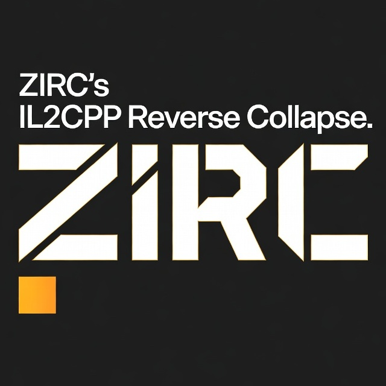

<p align="center">
  
</p>
<h1 align="center">ZIRC's IL2CPP Reverse Collapse</h1>

This repo show IL2CPP's reverse engineering of game "Girls' Frontline".

For a detailed list of features, see [this doc](docs/poc_list.md).

## 1. Arch

In short, this repo's directory tree can be listed as:

```sh
.
├── docs            # Documents
├── poc             # Proof of Concept (Single function units)
├── src             # Impl of PoC
│   ├── cpp             # C++ version
│   └── python          # Python version
└── tools           # dev tools and others
```